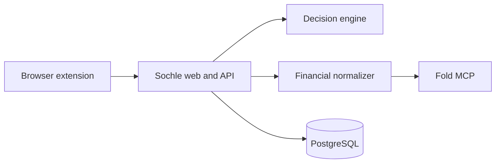

# सोचle

**A personal financial decision engine for the moment before you buy.**

Sochle answers a harder question than “Do I have enough money?” It combines current liquidity, upcoming obligations, expected income, planned investments, and a personal cash buffer to explain whether an online purchase is technically possible, comfortably affordable, or better delayed.

The first release is a private, single-user browser extension and companion web application for India. Fold's read-only MCP supplies financial observations; Sochle adds normalization, deterministic affordability calculations, confidence scoring, forecasting, and a decision history.

> Expense trackers tell you that you overspent after the purchase. Sochle helps you make the decision before it.

## Product principles

- Calculations before language: deterministic code produces every financial result.
- Evidence over confidence: verdicts expose inputs, freshness, assumptions, and uncertainty.
- Personal rules over generic advice: the user's buffer and goals define affordability.
- Read-only by default: Sochle recommends and records; it never moves money.
- Privacy by design: financial data is minimized, encrypted, and excluded from analytics.

## Initial product

- Browser extension for Amazon India, Flipkart, and Myntra product pages.
- Decision card with affordability, safe-to-spend, projected liquidity, and confidence.
- Companion web app for rules, decisions, connection status, and the Money Inbox.
- Fold MCP integration for balances, cards, transactions, spending, and recurring expenses.
- Audit trail preserving the exact snapshot and rule version behind every verdict.

## Architecture



The planned stack is TypeScript, pnpm workspaces, Next.js, WXT, PostgreSQL, Drizzle, Zod, and Vitest. The decision engine remains a pure package with no database, network, UI, or model dependency.

## Roadmap

| Milestone               | Outcome                                                               |
| ----------------------- | --------------------------------------------------------------------- |
| 0. Foundation           | Secure monorepo, contracts, CI, and synthetic demo mode               |
| 1. Financial foundation | Fold data normalized, persisted, reconciled, and freshness-labelled   |
| 2. Decision core        | Manual purchases receive deterministic, explainable verdicts          |
| 3. Point of purchase    | Amazon, Flipkart, and Myntra pages produce saved decisions end to end |
| 4. Personal beta        | Wait-until-payday, outcomes, weekly review, and dogfooding metrics    |
| 5. Closed loop          | Receipts, transactions, refunds, and predicted-versus-actual impact   |

See [MILESTONES.md](MILESTONES.md) for the implementation sequence and [SOCHLE_PRD.md](SOCHLE_PRD.md) for the complete product requirements.

## Current status

Milestones 0 and 1 are implemented. The next build phase is Milestone 2: the deterministic decision core.

## Local development

Requirements: Node.js 24+, pnpm 10+, and Docker.

```bash
pnpm install
cp .env.example .env
docker compose up -d postgres
pnpm dev
```

Before pushing changes, run:

```bash
pnpm format:check
pnpm lint
pnpm typecheck
pnpm test
pnpm build
```

## Fold usage and distribution

Fold MCP is used as a read-only personal data source. Sochle is initially a private, single-user project. Public multi-user access, distribution, or commercialization using Fold-derived data requires Fold's prior written approval.

Public demonstrations must use synthetic or explicitly redacted financial data.
