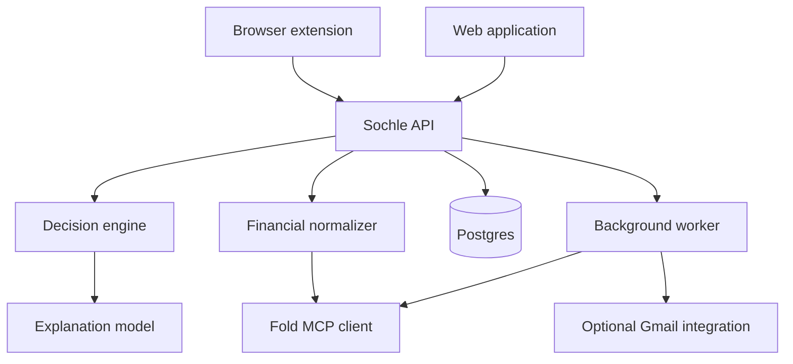

# Sochle — Product Requirements Document

**Working name:** Sochle / सोचle  
**Document status:** Draft v0.1  
**Date:** 17 August 2026  
**Initial owner:** Vaibhav Pandey  
**Product type:** Personal-first browser extension and financial decision engine  
**Primary market:** India, initially a private single-user build

---

## 1. Executive summary

Sochle is a browser extension and companion web application that helps a person decide whether to make a purchase **before** they pay for it.

Traditional personal-finance products explain spending after it has happened. Sochle intervenes at the moment of intent: while the user is viewing a product or preparing to check out. It combines the product price with the user's actual financial context—bank liquidity, credit-card obligations, upcoming recurring expenses, normal consumption, planned investments, personal cash buffer and future income—to produce a deterministic affordability assessment.

The user should not receive a generic “yes” or “no.” Sochle should explain:

- Whether the purchase is technically possible.
- Whether it is comfortably affordable.
- Whether it would compromise the user's liquidity buffer or investment target.
- When the purchase becomes comfortably affordable if it is not today.
- Which assumptions or dirty financial data reduce the confidence of the verdict.

The initial product will use Fold's authenticated, read-only MCP as its primary source of financial information. Sochle will add the missing decision layer: normalized financial state, user-defined rules, transaction corrections, forecasting, confidence scoring, purchase-intent tracking and an interface that appears directly on commerce pages.

The initial objective is not to become a multi-user fintech business. It is to build a polished personal tool that Vaibhav uses regularly and can demonstrate publicly as a technically credible build-in-public project. Multi-user distribution or commercialization using Fold data will require explicit written approval from Fold.

---

## 2. Product thesis

> Expense trackers tell users that they overspent after the purchase. Sochle helps them make the decision before it.

People usually evaluate purchases using one incomplete signal: the current bank balance or available credit limit. Neither represents affordability.

Real affordability depends on:

```text
Current liquidity
+ expected near-term income
− existing card and debt obligations
− essential upcoming expenses
− planned investments and savings
− minimum liquidity buffer
− other planned purchases
```

Sochle turns this model into an immediate, understandable decision at the point of purchase.

---

## 3. Problem statement

### 3.1 User problem

When considering a discretionary purchase, a user cannot quickly answer:

- Can I pay for this?
- Can I *comfortably* afford it?
- What will my finances look like after buying it?
- Will this interfere with rent, card payments, SIPs or my safety buffer?
- Would waiting until payday materially improve the decision?
- Am I making this decision using complete and correctly classified financial data?

The information required to answer these questions is fragmented across bank accounts, cards, investment apps, recurring-payment records and the user's memory.

### 3.2 Existing-product gap

Fold provides broad read-only financial context but does not currently provide a point-of-purchase decision workflow. Its data also requires interpretation before it can safely power decisions:

- Investment transfers can appear inside spending totals.
- Credit-card payments can be counted alongside card purchases.
- Transfers and refunds may be incorrectly included in cash flow.
- Recurring-expense detection may be incomplete.
- Merchant names can be inconsistent.
- Large transactions can remain untagged.
- Net-worth growth does not cleanly distinguish contributions from investment returns.

Sochle is not a replacement for Fold. Fold supplies the financial observations; Sochle creates a trusted decision model on top.

### 3.3 Why now

- Fold exposes 22 authenticated, read-only financial tools through a remote MCP endpoint.
- Browser extensions can identify product and price context directly from commerce pages.
- Models can explain deterministic financial calculations naturally without being trusted to perform the calculations themselves.
- The project is narrow enough for a solo engineer but technically rich enough to demonstrate MCP, OAuth, data normalization, forecasting, browser-extension engineering and agent evaluation.

---

## 4. Vision

### Near-term vision

Make Sochle the small voice that appears before a meaningful purchase and says:

> “You can afford it—but waiting until salary day preserves your ₹1 lakh buffer.”

### Long-term vision

Become a personal financial decision layer that connects intent, transactions and consequences:


The long-term product may evaluate purchases, subscriptions, travel, investment changes and other financial commitments, but the initial wedge remains discretionary online purchases.

---

## 5. Goals

### Product goals

1. Answer “Can I afford this?” in under five seconds from a supported product page.
2. Produce a transparent result based on deterministic calculations and visible assumptions.
3. Separate technical affordability from comfortable and goal-compatible affordability.
4. Make uncertain or dirty source data explicit instead of manufacturing confidence.
5. Create a lightweight review loop for correcting transactions and improving future verdicts.
6. Become useful enough that the owner voluntarily checks it before meaningful purchases.
7. Create a visually compelling, technically honest build-in-public demonstration.

### Engineering goals

1. Implement Fold remote MCP authentication and secure token handling.
2. Normalize heterogeneous Fold responses into a stable internal financial schema.
3. Build a deterministic, testable affordability and forecast engine.
4. Extract price/product information reliably from Amazon India, Flipkart and Myntra.
5. Preserve an audit trail explaining every input and rule behind every verdict.
6. Keep financial data private and minimize third-party model exposure.

---

## 6. Non-goals

The MVP will not:

- Move money, pay bills or initiate purchases.
- Place stock or mutual-fund orders.
- Provide regulated investment, tax, credit or legal advice.
- Replace Fold as a personal-finance dashboard.
- Build a complete monthly budgeting system.
- Support every Indian commerce website.
- Guarantee that a purchase is objectively good or worthwhile.
- Make decisions solely through an LLM.
- Launch as a public multi-user product using Fold data without Fold's approval.
- Optimize credit-card rewards, EMI plans or BNPL products in the first release.

---

## 7. Target users

### Primary user: owner-operator

A salaried, technically sophisticated user who:

- Earns regularly.
- Maintains an emergency/liquidity buffer.
- Invests monthly through SIPs or brokerage accounts.
- Uses a credit card.
- Makes discretionary online purchases.
- Wants practical intervention without maintaining a manual spreadsheet.
- Is comfortable reviewing and correcting ambiguous financial data.

The first real user is Vaibhav. The product should be designed around actual usage rather than a fictional mass-market persona.

### Future user archetype

Young salaried Indian professionals who can technically pay for purchases but struggle to understand whether those purchases fit their wider financial commitments.

---

## 8. Jobs to be done

### Primary job

> When I am considering a meaningful purchase, help me understand its effect on my finances so I can buy it confidently, delay it or skip it.

### Supporting jobs

- Tell me how much I can safely spend right now.
- Tell me when an unaffordable purchase becomes affordable.
- Show which obligation or goal creates the constraint.
- Remember purchases I am considering.
- Help me resolve financial transactions that make the forecast unreliable.
- Compare what I intended to buy with what I eventually purchased.
- Review whether previous purchase decisions were financially sound.

---

## 9. Product principles

### 9.1 Calculations before language

All financial outputs must come from deterministic code. An LLM may explain the result, normalize ambiguous text with safeguards or produce conversational copy; it must not independently calculate affordability.

### 9.2 Evidence over confidence

Every verdict must expose its relevant inputs, timestamps, assumptions and confidence level.

### 9.3 Personal rules beat generic morality

Sochle should not shame ordinary spending. It evaluates purchases against the user's chosen buffer, commitments and goals.

### 9.4 Read-only by default

The initial product recommends and records; it does not transact.

### 9.5 Intervention, not obstruction

Sochle should introduce useful friction without making checkout unusable. The user can dismiss it instantly.

### 9.6 Hinglish personality, serious financial core

The surface may say “सोचle,” “abhi nahi,” or “salary ke baad.” The underlying model must remain precise, auditable and sober.

---

## 10. Product surfaces

### 10.1 Browser extension

The primary interface. It detects eligible product or checkout pages and displays a small, dismissible Sochle control.

Capabilities:

- Detect product title, displayed price, merchant and page URL.
- Allow manual correction of extracted price.
- Trigger affordability calculation.
- Display verdict, confidence and concise reasoning.
- Expand to show calculation details.
- Save the product for later.
- Record “bought,” “skipped,” “waiting” or “not relevant.”
- Open the full web application.

### 10.2 Decision card

The result shown within the extension.

Required fields:

- Verdict.
- Purchase price.
- Safe-to-spend amount.
- Projected liquidity after purchase.
- Minimum buffer after purchase.
- Next date on which the purchase becomes comfortably affordable, when calculable.
- Primary trade-off.
- Confidence level.
- Data freshness.
- Link to detailed calculation.

### 10.3 Companion web application

Provides configuration, review and history.

Initial screens:

1. **Today:** liquidity, obligations, safe-to-spend and open data issues.
2. **Decisions:** considered purchases and their outcomes.
3. **Money Inbox:** unresolved transactions and data-quality issues.
4. **Rules:** buffer, income, investment target and purchase thresholds.
5. **Connections:** Fold authentication and refresh status.

### 10.4 Weekly Sochle review

A generated weekly summary showing:

- Purchases considered.
- Purchases made, skipped and delayed.
- Amount preserved by waiting or skipping.
- Upcoming obligations.
- Changes in safe-to-spend amount.
- Open transaction classifications.
- Predictions that proved inaccurate.

Delivery in MVP: inside the web application. Email or Telegram delivery is a later enhancement.

---

## 11. Affordability model

Sochle must not collapse affordability into one number. It produces three assessments.

### 11.1 Technically affordable

Can the user make the purchase without borrowing additional money or liquidating investments?

```text
technical_headroom = liquid_cash − immediate_obligations − purchase_price
```

### 11.2 Comfortably affordable

Can the purchase be made while preserving the user's minimum liquidity buffer?

```text
comfortable_headroom =
    liquid_cash
  + expected_income_within_horizon
  − confirmed_obligations_within_horizon
  − minimum_liquidity_buffer
  − purchase_price
```

### 11.3 Goal-compatible

Can the purchase be made while preserving planned savings and investments?

```text
goal_headroom =
    liquid_cash
  + expected_income_within_horizon
  − essential_spending_forecast
  − confirmed_obligations
  − planned_investments
  − planned_purchases
  − minimum_liquidity_buffer
  − purchase_price
```

### 11.4 Verdict taxonomy

| Verdict | Meaning |
|---|---|
| Comfortably affordable | Purchase preserves buffer and goals. |
| Affordable with trade-offs | Purchase is possible but compromises a target. |
| Wait until payday | A known upcoming income event resolves the constraint. |
| Requires reducing investments | Purchase fits only by lowering planned investment. |
| Technically possible, financially tight | Cash exists, but buffer would be breached. |
| Not affordable | Purchase cannot be covered safely within the configured horizon. |
| Insufficient confidence | Data quality is too poor for a responsible verdict. |

### 11.5 Configurable rules

P0 rules:

- Minimum liquidity buffer.
- Monthly expected salary and normal salary date.
- Essential monthly spending estimate.
- Monthly investment target.
- Large-purchase threshold.
- Forecast horizon: salary date, 30 days or custom.

P1 rules:

- Category-specific budgets.
- Planned travel or one-time expenses.
- Different buffers for normal and emergency periods.
- Card-payment preferences.
- Purchase cooling-off period by price.

---

## 12. Confidence and financial data quality

Every result receives a confidence rating.

### High confidence

- Financial accounts refreshed recently.
- No large unresolved transactions in the relevant period.
- Upcoming obligations are known.
- Salary and investment assumptions have been confirmed.
- No suspected transfer or credit-card double counting materially changes the result.

### Medium confidence

- Some transactions are unclassified but below a materiality threshold.
- One source is stale but not expected to change the verdict.
- Credit-card data is between 24 and 72 hours old, matching the observed provider cadence.
- Credit-card data older than 72 hours has bounded remaining-credit exposure that does not change the verdict.
- Recurring expenses rely partially on user-entered assumptions.

### Low confidence

- Large unclassified transactions exist.
- Account data is stale or connection is pending.
- Credit-card data is older than 72 hours and its remaining-credit exposure can change the verdict or cannot be bounded.
- Card outstanding and repayment state conflict.
- The verdict changes depending on whether an ambiguous transaction is treated as spending.
- Expected income is uncertain.

### Materiality

An unresolved item is material if resolving it could change the verdict category or move projected liquidity by more than the configured threshold. Initial default: the lower of ₹5,000 or 10% of the purchase price.

### Required behaviour

When confidence is low, Sochle must show the uncertainty:

> “Probably affordable, but one ₹50,500 transaction is unclassified. Resolve it for a reliable answer.”

---

## 13. Money Inbox

The Money Inbox is Sochle's correction and learning layer.

### Issue types

- Large untagged transaction.
- Possible self-transfer.
- Possible duplicate charge.
- Credit-card repayment likely double-counted.
- Refund unmatched to original purchase.
- Repeated merchant not marked as recurring.
- Merchant aliases likely representing the same business.
- Recurring amount inconsistent with observed payment.
- Stale account or connection problem.

### Available actions

- Classify as consumption, investment, transfer, credit-card payment, refund, lending or income.
- Exclude from Sochle cash-flow calculations.
- Merge merchant alias into canonical merchant.
- Mark or unmark recurring.
- Confirm expected recurring amount.
- Ignore once.
- Create a persistent rule.

Corrections are stored in Sochle's own database because Fold MCP is read-only.

---

## 14. Primary user flows

### 14.1 First-time setup

1. Install extension.
2. Create local/personal Sochle account.
3. Connect Fold through remote MCP authentication and OTP.
4. Import current financial snapshot.
5. Configure minimum liquidity buffer.
6. Confirm salary amount/date, essential spending and monthly investment target.
7. Review material unresolved transactions.
8. Receive initial safe-to-spend estimate.

### 14.2 Purchase evaluation

1. User visits a supported product page.
2. Extension extracts product and price.
3. User invokes Sochle.
4. Backend refreshes financial state if required.
5. Deterministic engine calculates assessments.
6. Extension displays verdict and confidence.
7. User expands evidence or records a decision.

### 14.3 Wait-until-payday

1. Purchase breaches current buffer.
2. Forecast engine evaluates upcoming salary and obligations.
3. Sochle identifies the first date on which the configured conditions hold.
4. User saves product and optionally requests a reminder.

### 14.4 Resolve uncertainty

1. Verdict is low confidence.
2. User opens the blocking issue from the decision card.
3. User classifies the relevant transaction.
4. Sochle recalculates immediately.
5. Decision audit trail records the corrected input.

---

## 15. Functional requirements

### P0 — MVP

#### Authentication and data

- Connect to `https://mcp.fold.money/mcp` using the supported remote MCP authorization flow.
- Store tokens encrypted and server-side only.
- Retrieve bank balance, connected accounts, credit-card state, recurring expenses, upcoming cycles, spending summary and transactions.
- Retrieve net worth and investment summaries for context, not spendable cash.
- Refresh data manually and automatically according to conservative rate limits.
- Store normalized snapshots with source timestamps.

#### Rules and calculations

- Configure salary, essential spending, buffer and investment target.
- Calculate technical, comfortable and goal-compatible affordability.
- Generate deterministic verdict and confidence.
- Show full calculation breakdown.
- Record versioned inputs and rule set for each verdict.

#### Extension

- Support Amazon India, Flipkart and Myntra product pages.
- Extract product name and price using site-specific adapters.
- Allow manual price override.
- Display decision card without obstructing the page.
- Save decision and open web application.

#### Web application

- Today screen.
- Decisions list and detail.
- Rules configuration.
- Money Inbox for large untagged transactions and manual overrides.
- Connection status and data freshness.

### P1 — Useful personal beta

- Generic structured-data/DOM fallback for additional sites.
- Product watchlist and wait-until-payday reminders.
- Merchant normalization and alias rules.
- Duplicate-transaction and recurring-expense detection.
- Weekly review.
- Gmail receipt ingestion and transaction matching.
- Refund and return-window tracking.
- Telegram delivery for alerts and weekly summary.
- Purchase outcome tracking.

### P2 — Advanced personal product

- Zerodha read-only integration.
- Contribution-versus-market-return analysis.
- Cash-versus-card comparison.
- Price history and price-drop tracking.
- Goal-aware opportunity cost.
- Multi-scenario simulations.
- Mobile share-sheet workflow.
- On-device financial processing where practical.

### Explicitly deferred

- Multi-user Fold authentication.
- Public launch using Fold-derived data.
- Autonomous financial actions.
- Card rewards and EMI optimization.
- Account Aggregator production integration.

---

## 16. Fold MCP integration

### Tools expected in MVP

- `get_total_balance`
- `list_bank_accounts`
- `list_credit_cards`
- `list_transactions`
- `get_transaction`
- `get_spending_summary`
- `list_recurring_expenses`
- `list_upcoming_recurring_cycles`
- `get_net_worth`
- `get_net_worth_history`
- `get_mf_portfolio_summary`
- `get_stocks_portfolio_summary`

Other Fold tools may enrich the long-term view but are not required for the first purchase verdict.

### Integration constraints

- Fold MCP is read-only.
- MCP access is currently an experimental beta.
- Access can be modified, suspended or revoked.
- The user must maintain an eligible Fold subscription and enable MCP.
- Fold's current fair-use terms describe MCP as intended for personal use and evaluation.
- A public, distributed or paid product that exposes Fold data or substantially similar functionality requires prior written approval from Fold.

### Resilience

Sochle must:

- Cache the last successful normalized snapshot with freshness labels.
- Degrade gracefully when Fold is unavailable.
- Never silently treat stale data as current.
- Allow user-maintained rules and corrections to survive Fold outages.
- Keep the Fold adapter isolated so another financial source can be introduced later.

---

## 17. AI requirements

### Appropriate AI usage

- Explain a deterministic verdict in concise natural language.
- Normalize merchant aliases, subject to confidence thresholds and user confirmation.
- Extract receipt details from email.
- Match receipts to transactions using a scored candidate system.
- Summarize weekly decisions and unresolved issues.
- Convert natural-language planned expenses into structured proposals requiring confirmation.

### Prohibited AI usage

- Calculating balances or affordability without deterministic verification.
- Inventing missing income, obligations or transaction classifications.
- Hiding uncertainty.
- Giving investment or tax advice.
- Sending full raw financial history to a model when a minimized structured subset is sufficient.

### Evaluation expectations

Maintain fixtures for:

- Transfer versus spending ambiguity.
- Credit-card repayment double counting.
- Salary arriving before/after purchase.
- Rent inconsistency.
- Refund matching.
- Stale account data.
- Low-confidence merchant normalization.
- Identical-price products and duplicate charges.

---

## 18. Data model — bird's-eye view

### Core entities

#### Connection

- Provider
- Encrypted authorization reference
- Status
- Last successful sync
- Last failure

#### Financial account

- Source account ID
- Type
- Institution
- Masked display name
- Current balance/outstanding
- Last refreshed time

#### Normalized transaction

- Source transaction ID
- Account
- Date
- Amount
- Direction
- Raw merchant
- Canonical merchant
- Source category
- Sochle classification
- Cash-flow inclusion state
- Confidence

#### Financial snapshot

- Liquid balance
- Card obligations
- Upcoming obligations
- Investment value
- Safe-to-spend components
- Source timestamps

#### Rule set

- Minimum buffer
- Expected income schedule
- Essential spending
- Investment target
- Materiality threshold
- Forecast horizon
- Version

#### Purchase intent

- Product title
- Merchant
- Price
- URL
- Detected time
- Status
- Decision
- Purchase/receipt/transaction links

#### Decision

- Verdict
- Confidence
- Calculation inputs
- Rule-set version
- Evidence snapshot
- Explanation
- Created time

#### Data issue

- Type
- Severity
- Materiality
- Related entity
- Status
- User resolution

---

## 19. Technical architecture



### Recommended initial stack

#### Monorepo

- Bun workspaces or pnpm.
- TypeScript throughout for speed and shared types.

#### Web application

- Next.js or React/Vite.
- Tailwind or a small design-system layer.
- Server-side rendering is optional; this is primarily an authenticated application.

#### Browser extension

- WXT or Plasmo.
- React interface.
- Manifest V3.
- Site-specific content-script adapters plus a generic fallback.

#### Backend

- TypeScript service using Hono, Fastify or Nest only if its additional structure is justified.
- Official MCP TypeScript SDK for remote MCP communication.
- Zod schemas around every external response.

#### Persistence

- PostgreSQL.
- Drizzle or Prisma.
- Encrypted token fields using an application-managed encryption key.

#### Jobs

- Lightweight database-backed job runner initially.
- Scheduled financial refresh, issue detection and weekly report generation.

#### Observability

- Structured logs with financial values redacted.
- Error tracking.
- Audit events for authentication, sync, decision generation and rule changes.
- Metrics for sync success, decision latency and extraction failure.

### Why TypeScript first

The extension, application and MCP client can share schemas and decision types. A Go backend may later be justified for portfolio value or as a separate engineering exercise, but it would increase initial integration overhead without improving the user outcome.

---

## 20. Security and privacy

Financial data makes security a product requirement, not a cleanup task.

### Required controls

- All Fold tokens stored encrypted at rest.
- Tokens never exposed to extension content scripts or browser pages.
- Content scripts receive only the minimum verdict payload.
- Strict extension host permissions limited to supported sites.
- No logging of raw tokens, account numbers, transaction narration or full balances.
- Mask account identifiers in the interface.
- CSRF protection and secure callback handling.
- Content Security Policy for extension and web application.
- Dependency and secret scanning in CI.
- Explicit data-deletion path.
- Versioned audit trail for rule and classification changes.
- No third-party analytics receiving financial values.

### Model privacy

- Send minimized structured inputs, not full transaction histories.
- Remove account identifiers and transaction IDs before model calls.
- Prefer local/deterministic merchant rules when possible.
- Make model usage visible in privacy documentation.

### Public demos

- Use seeded or redacted demonstration data.
- Never expose real tokens, account IDs, transaction IDs or unmasked financial values.
- Maintain a dedicated demo mode capable of reproducing the experience safely.

---

## 21. Billing and commercialization

### MVP billing decision

**No billing in the initial release.**

Reasons:

- The first objective is personal retention and technical validation.
- Fold's present MCP terms restrict building, launching, distributing or selling a substantially similar service or exposing Fold capabilities to third parties without written approval.
- Introducing payments before repeated personal usage would optimize the wrong signal.

### Initial operating mode

- Single private account.
- Self-funded infrastructure.
- Build-in-public content and waitlist permitted only as interest validation; do not accept payment or enable Fold-backed multi-user access without approval.

### Future pricing hypothesis — only after approval

Potential structure:

| Tier | Indicative price | Possible scope |
|---|---:|---|
| Personal | Free | Limited checks, manual rules, local history. |
| Plus | ₹199–₹299/month | Unlimited checks, automatic refresh, weekly review, Gmail matching. |
| Pro | ₹499–₹699/month | Multiple integrations, advanced forecasting, portfolio and household rules. |

These prices are hypotheses, not commitments. Pricing should be tested only after users demonstrate repeated behaviour and Fold provides written commercial authorization.

### Costs to monitor

- Model inference per decision and weekly report.
- Background refresh frequency.
- Database and job infrastructure.
- Email ingestion.
- Error monitoring.
- Fold subscription/access requirements borne by the user or product.

### Billing success condition

Do not introduce billing until at least five design partners use Sochle weekly for four consecutive weeks and at least three explicitly state they would be disappointed to lose it.

---

## 22. Traction strategy

The first traction goal is not sign-ups. It is evidence that the product changes real purchase behaviour.

### Phase 0: personal dogfooding

- Use Sochle on every discretionary online purchase above the configured threshold.
- Record decisions and outcomes for four weeks.
- Track whether verdicts were trusted, ignored or wrong.
- Publish sanitized technical progress.

### Phase 1: build-in-public audience

Content sequence:

1. “Expense trackers tell you after. I am building one that intervenes before.”
2. Fold remote MCP authentication and normalized financial schema.
3. Why real spending data is dirty and how Sochle reconciles it.
4. Live browser-extension demo on a high-value purchase.
5. Purchase intent → receipt → transaction → consequence trace.
6. Four-week personal usage results.

### Phase 2: controlled design partners

Only after Fold approval or with non-Fold/manual data:

- Invite 5–10 trusted users.
- Conduct weekly interviews.
- Measure checks, decisions, follow-through and false verdicts.
- Avoid broad public launch until reliability is demonstrated.

---

## 23. Success metrics

### North-star metric

**Meaningful purchase decisions completed per active user per month.**

A decision counts when:

- A real product and price are evaluated.
- The user views the verdict.
- The user records or later exhibits an outcome: bought, waited or skipped.

### Personal MVP success — first four weeks

- At least 10 genuine purchase evaluations.
- At least 70% of eligible purchases above the threshold are checked.
- At least 5 decisions are recorded with an eventual outcome.
- At least 2 purchases are meaningfully delayed, modified or skipped.
- At least 80% of verdicts are judged directionally correct by the owner.
- Fewer than 10% of verdicts contain a material calculation or classification error.
- Median extension decision latency under five seconds using a fresh snapshot.
- The owner voluntarily opens the weekly review in at least three of four weeks.

### Product-validation success — future design partners

- 60% week-four retention among invited users.
- Median of two meaningful checks per weekly active user.
- At least 40% of users resolve one or more Money Inbox issues.
- At least 30% of checks cause a documented wait, skip or purchase-plan change.
- At least 50% say they would be disappointed if the product disappeared.

### Build-in-public success

These are secondary, not product validation:

- A polished public demo published.
- Meaningful technical discussion from engineers or fintech builders.
- 100 qualified waitlist sign-ups is a positive audience signal.
- One conversation with Fold about approval, feedback or collaboration is a strategic success.

LinkedIn impressions alone do not count as product traction.

---

## 24. What counts as failure

The MVP is not working if, after four weeks:

- The owner rarely remembers to invoke it.
- Most checked purchases are too small to justify the friction.
- Verdicts are obvious from bank balance alone.
- Data-cleaning effort exceeds decision value.
- More than 20% of verdicts are materially misleading.
- Fold refresh latency prevents point-of-purchase use.
- The user repeatedly dismisses the overlay without checking.
- No purchase is delayed, skipped or modified.
- The weekly review does not reveal anything actionable.

### Response to failure

- If invocation is the problem: improve automatic detection and reduce interaction cost.
- If trust is the problem: simplify the model, expose evidence and improve confidence gating.
- If data quality is the problem: prioritize Money Inbox and persistent rules.
- If frequency is the problem: expand from product purchases to travel, subscriptions or large UPI decisions.
- If outcomes never change: reposition as purchase planning rather than intervention, or stop the project.

---

## 25. Rollout plan

### Milestone 1 — Financial foundation

**Goal:** obtain and normalize trustworthy data.

- Fold MCP authentication.
- Account, balance, card and recurring-expense ingestion.
- Transaction pagination and normalization.
- Snapshot persistence.
- Manual sync and freshness indicators.
- Basic Money Inbox.

**Exit criterion:** the internal state can reproduce the relevant Fold totals and explicitly explain discrepancies.

### Milestone 2 — Decision engine

**Goal:** answer affordability questions from manually entered purchases.

- Rule configuration.
- Three affordability assessments.
- Verdict taxonomy.
- Confidence model.
- Decision audit trail.
- Scenario tests.

**Exit criterion:** a manual ₹45,000 purchase scenario produces a correct, explainable result across tested edge cases.

### Milestone 3 — Browser extension

**Goal:** move the decision to the point of intent.

- Amazon India adapter.
- Flipkart adapter.
- Myntra adapter.
- Decision card.
- Manual correction.
- Save and outcome actions.

**Exit criterion:** live end-to-end demo from product page to recorded decision.

### Milestone 4 — Personal beta

**Goal:** make it useful every week.

- Purchase history.
- Wait-until-payday.
- Weekly review.
- Improved Money Inbox.
- Four weeks of dogfooding.

**Exit criterion:** personal success metrics reviewed with a written continue/pivot/stop decision.

### Milestone 5 — Closed loop

**Goal:** connect intent to actual outcome.

- Gmail receipt ingestion.
- Receipt-to-transaction matching.
- Refund/return tracking.
- Predicted versus actual financial impact.

**Exit criterion:** at least three real purchases traced end to end.

---

## 26. Testing and quality

### Unit tests

- Every affordability equation.
- Boundary values around the minimum buffer.
- Income arriving at different forecast dates.
- Obligations before and after salary.
- Credit-card repayments excluded from consumption.
- Investments excluded from discretionary spending.
- Materiality and confidence transitions.

### Contract tests

- Validate every consumed Fold tool response against local schemas.
- Record sanitized fixtures for regressions.
- Handle missing, null, stale and disconnected states.

### Extension tests

- Price extraction across supported page variants.
- Sale price versus MRP.
- Multiple sellers.
- Dynamic page updates.
- Currency and comma formatting.
- Permission boundaries.

### End-to-end tests

- Connect Fold → sync → configure rules → evaluate product → save decision.
- Low-confidence decision → resolve issue → recalculate.
- Fold unavailable → cached result with freshness warning.

### Financial correctness standard

Any bug that changes a verdict category is severity 1 and blocks release. Copy defects and minor rounding differences do not.

---

## 27. Risks and mitigations

| Risk | Impact | Mitigation |
|---|---|---|
| Fold changes or removes MCP access | Product loses primary data source | Adapter isolation, cached state, manual import fallback. |
| Fold terms block public distribution | Cannot commercialize current architecture | Personal-first scope; seek written approval; keep source adapters modular. |
| Dirty data creates misleading verdicts | Loss of trust | Confidence gating, materiality rules, Money Inbox and audit trail. |
| Extension extraction breaks | Product fails at point of use | Site adapters, monitoring, manual price override, generic structured-data fallback. |
| Financial-data breach | Severe personal harm | Encryption, minimization, strict permissions, redacted logs and private hosting. |
| LLM invents reasoning | Misleading advice | Deterministic calculations; templated evidence; model output validation. |
| Product becomes moralizing | User disables it | User-defined rules, neutral language, easy dismissal. |
| Low purchase frequency | Insufficient retention | Focus on meaningful purchases; later extend to travel and subscriptions only if needed. |
| Scope expands into generic finance dashboard | Slow delivery and weak differentiation | Protect the point-of-purchase wedge and defer broad analytics. |

---

## 28. Open questions

These do not block initial engineering but must be resolved during Milestones 1–3.

1. Should the default buffer be an absolute amount or months of essential expenses?
2. How should unsettled credit-card transactions affect current-cycle obligations?
3. Should planned SIPs always be treated as fixed obligations or adjustable goals?
4. What purchase value should trigger automatic Sochle visibility?
5. Should the extension appear automatically or only after the user clicks it?
6. How long may a cached financial snapshot remain usable?
7. Should safe-to-spend use the next salary date or a rolling 30-day horizon by default?
8. How should joint or passively tracked accounts be handled?
9. Should “amount preserved” count delayed purchases or only confirmed skips?
10. What public data may be safely shown in build-in-public demos?

---

## 29. Initial product copy

### Brand

**सोचle.**

### Decision prompts

- “₹45,000 का है. सोचle.”
- “Technically ले सकता है.”
- “Abhi nahi. Salary ke baad comfortably.”
- “Buffer टूटेगा.”
- “Affordable है—but SIP compromise होगी.”
- “Data थोड़ा sus है. पहले ₹50,500 वाला transaction classify कर.”
- “Haan, इस बार ले ले.”

### Trust copy

- “Based on data refreshed 12 minutes ago.”
- “One unresolved transaction may change this result.”
- “Investments are not treated as spendable cash.”
- “Sochle calculates; AI only explains.”

---

## 30. Launch checklist

### Product

- [ ] Buffer, salary, essential spending and investment settings configured.
- [ ] Verdict calculations reviewed against manual spreadsheet cases.
- [ ] Confidence and stale-data states implemented.
- [ ] Money Inbox resolves material data issues.
- [ ] Amazon India, Flipkart and Myntra extraction validated.
- [ ] Decision history and outcome recording work.

### Security

- [ ] Tokens encrypted and absent from client bundles.
- [ ] Logs verified to contain no sensitive financial payloads.
- [ ] Extension permissions minimized.
- [ ] Demo mode uses seeded/redacted data.
- [ ] Data export and deletion tested.

### Build in public

- [ ] Fold attribution and beta limitations stated accurately.
- [ ] No public multi-user access without written approval.
- [ ] Architecture diagram prepared.
- [ ] Demo financial values redacted or synthetic.
- [ ] Technical write-up covers reconciliation and deterministic calculations.

---

## 31. One-sentence scope guard

> Sochle helps a user understand the financial consequence of an online purchase before making it; anything that does not materially improve that decision is outside the MVP.

---

## 32. Immediate next actions

1. Create the monorepo and internal normalized schemas.
2. Implement Fold remote MCP authentication in a minimal backend spike.
3. Persist one complete financial snapshot and reconcile it with Fold's headline totals.
4. Encode the affordability model as pure, tested functions.
5. Build a manual purchase simulator before starting the extension.
6. Validate the ₹45,000 Garmin scenario and at least ten adversarial cases.
7. Build the Amazon India extension adapter and decision card.
8. Begin four-week personal dogfooding before expanding scope.
