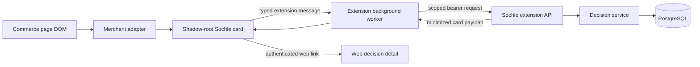

# Milestone 3: Point-of-Purchase Extension

**Status:** Approved design

**Date:** 2026-08-17

**Source:** `SOCHLE_PRD.md`, sections 9, 10, 14, 15, 19, 20, 25, and 26; `MILESTONES.md`, Milestone 3; `docs/TESTING.md`

## Objective

Milestone 3 moves Sochle's deterministic purchase decision from the manual web form to Amazon India, Flipkart, and Myntra product pages. A paired browser extension extracts product context, lets the owner correct it, requests a decision against the latest persisted financial snapshot, automatically stores the immutable decision, displays a minimized decision card, and records the purchase outcome.

The cached path must produce a result in under five seconds when the current snapshot and rules are available. Commerce pages, extension content scripts, and extension UI never receive Fold credentials, raw transactions, account details, full snapshots, rule sets, or decision audit bundles.

## Scope

### Included

- One-time extension pairing owned by the existing single-owner web login.
- Revocable, extension-specific bearer credentials with hashes stored server-side.
- Exact Manifest V3 permissions for Amazon India, Flipkart, Myntra, the configured Sochle API origin, extension storage, and the browser identity flow.
- Merchant-specific product adapters and locale-aware INR parsing.
- A passive, dismissible in-page control for products at or above the configured large-purchase threshold.
- Manual title and price correction before evaluation.
- Automatic immutable persistence for every completed calculation.
- A minimized decision-card API and extension card.
- Waiting, bought, skipped, and not-relevant outcomes.
- Links from the extension to the full authenticated decision detail.
- Sanitized DOM fixtures, integration coverage, browser E2E coverage, security assertions, cached-path timing, and manual live smoke checks.

### Excluded

- Separate extension usernames, passwords, or Fold authentication.
- Multi-user accounts, social login, email login, or account recovery.
- Generic support for merchants beyond the three named sites.
- Price history, price-drop alerts, reminders, receipt matching, refunds, or automatic purchase detection.
- Automatic Fold refresh during a product-page calculation.
- Sending financial data to analytics or model providers.
- Replacing the deterministic explanation templates with generated copy.

## Architecture

The extension has three boundaries:

1. Merchant adapters read untrusted page DOM and return only normalized product context.
2. The content UI owns the shadow-root control and card but never reads pairing credentials.
3. The background service worker owns pairing, credential storage, request validation, and all Sochle API calls.

The web application remains the only public API and the only component that can load snapshots, rules, issues, Fold authorization, and immutable audit records. Extension routes authenticate a pairing credential independently of the owner-session cookie and expose only explicitly minimized contracts.



No content-script message may accept an arbitrary URL, HTTP method, or request body. The background worker exposes named operations with contract validation so a compromised page cannot turn it into a general authenticated proxy.

## Pairing and Authentication

The extension presents a `Sign in to Sochle` action, but the web application owns the actual login and approval.

### Pairing flow

1. The background worker generates a cryptographically random bearer credential and keeps it in extension-local memory.
2. It derives a SHA-256 hash and obtains the browser identity callback URL with `browser.identity.getRedirectURL("pair")`.
3. It creates a short-lived pairing request through the public pairing-request endpoint. The server derives the extension origin from the request `Origin` header and verifies that its extension ID matches the identity callback hostname.
4. The server returns an opaque request ID and an authenticated web approval URL. Pairing requests expire after ten minutes.
5. `browser.identity.launchWebAuthFlow` opens the approval URL. The owner signs in to the web app if necessary and sees the requesting extension origin before approving.
6. Approval requires the owner session and a session-bound CSRF token. In one transaction, the server creates an active pairing with the pending credential hash and marks the request consumed.
7. The approval route redirects to the exact callback URL stored on the pairing request. The extension verifies the returned request ID matches the request it initiated.
8. The background worker calls the session endpoint with the raw bearer credential. A successful response proves pairing completion; only then does the extension persist the credential in `chrome.storage.local`.

The raw credential is never sent to the approval page, placed in a URL, logged, or stored in PostgreSQL. A rejected, expired, mismatched, or replayed request cannot create a pairing. Failed flows discard the in-memory credential.

### Pairing lifecycle

An active pairing stores its ID, owner connection ID, credential hash, extension origin, optional owner-visible label, creation time, last-used time, and revocation time. Connections lists active and revoked pairings without exposing hashes. The owner can revoke any pairing from the web app; the extension can revoke only its own credential. Revocation takes effect before the next protected request.

Pairing authentication permits only:

- reading extension configuration and connection readiness;
- creating a purchase decision from validated product context;
- updating the outcome of a purchase intent created through that pairing;
- revoking the current pairing.

Pairing authentication cannot invoke Fold, initiate sync, read accounts or transactions, list snapshots or decisions, fetch full decision detail, edit financial rules, export data, delete owner data, or administer other pairings.

### CORS

Extension API responses echo only a syntactically valid `chrome-extension://<id>` origin that matches either the pending request or authenticated active pairing. Preflight responses allow only the required methods and headers. Web owner routes do not share this CORS policy.

## Persistence

Two additive tables support pairing:

- `extension_pairing_requests`: opaque ID, credential hash, extension origin, callback URL, expiry, approval, consumption, and creation timestamps.
- `extension_pairings`: opaque ID, owner connection ID, credential hash, extension origin, label, creation, last-used, and revocation timestamps.

Credential hashes are unique and indexed. Expired requests are rejected even if not yet physically deleted.

Purchase intents gain nullable extension provenance so existing manual decisions remain valid:

- source: `manual` or `extension`;
- pairing ID;
- merchant;
- canonical product URL;
- extraction confidence;
- originally extracted title;
- originally extracted price in paise.
- an extension-generated idempotency key.

The existing `description` and `priceMinor` fields remain the corrected values used for calculation. This preserves both what the adapter observed and what the owner approved without placing product context inside the financial calculation model. A unique `(pairingId, idempotencyKey)` index guarantees that retrying one card request returns the existing decision instead of creating a duplicate.

Purchase-intent status adds `waiting` and `not_relevant`. Existing statuses remain compatible. Extension labels map as follows:

| Extension action | Stored status  |
| ---------------- | -------------- |
| No outcome yet   | `considering`  |
| Save for later   | `waiting`      |
| Bought           | `purchased`    |
| Skipped          | `skipped`      |
| Not relevant     | `not_relevant` |

`planned` remains reserved for a dated plan. Milestone 4 may promote a waiting intent to a dated planned intent.

Deletion removes pairing requests, pairings, extension provenance, intents, decisions, and audit events through explicit repository behavior or foreign-key cascades. Export includes non-secret pairing metadata and product provenance but never credential hashes.

## Contracts and API

All extension request, response, and message boundaries use shared Zod schemas in `@sochle/contracts`. Money is represented as `{ currency: "INR", minor: integer }`; no floating-point rupee values cross a boundary.

### Product context

```ts
type Merchant = "amazon.in" | "flipkart.com" | "myntra.com";

type ExtractionConfidence = "high" | "medium" | "low";

type ExtractedProduct = {
  canonicalUrl: string;
  confidence: ExtractionConfidence;
  merchant: Merchant;
  price: { currency: "INR"; minor: number } | null;
  title: string;
};

type ProductDecisionRequest = {
  correctedPrice: { currency: "INR"; minor: number };
  correctedTitle: string;
  extracted: ExtractedProduct;
};
```

URLs must use HTTPS, match the submitted merchant, contain no credentials, and have fragments and known tracking parameters removed. Titles are trimmed and length-bounded. Prices must be positive safe integers and remain within the domain engine's safe range. Unknown fields are rejected.

### Minimized decision response

```ts
type ExtensionDecisionCard = {
  bufferHeadroomMinor: number;
  confidence: "high" | "medium" | "low";
  decisionUrl: string;
  evaluatedAt: string;
  firstComfortablyAffordableDate: string | null;
  freshness: "fresh" | "aging" | "stale" | "missing";
  headline: string;
  intentId: string;
  priceMinor: number;
  primaryAction: string | null;
  primaryTradeoff: string;
  projectedLiquidityMinor: number;
  safeToSpendMinor: number;
  verdict:
    | "comfortably_affordable"
    | "affordable_with_tradeoffs"
    | "wait_until_payday"
    | "requires_reducing_investments"
    | "technically_possible_financially_tight"
    | "not_affordable"
    | "insufficient_confidence";
};
```

`safeToSpendMinor` is the pre-purchase goal-compatible headroom. `projectedLiquidityMinor` is liquid cash immediately after the candidate price. `bufferHeadroomMinor` is the candidate's comfortable headroom after reserving immediate obligations and the configured minimum buffer. The trade-off and action come from the stored deterministic explanation. Freshness is the worst required-source state used by the decision.

The response intentionally excludes snapshot IDs, rule-set IDs, account data, transactions, obligations, income events, issue details, audit inputs, daily forecast rows, and credential material.

### Routes

- `POST /api/extension/pairing-requests`: create an expiring request from a validated extension origin and identity callback.
- `GET /extension/pair`: authenticated owner approval page.
- `POST /api/extension/pairing-requests/[id]/approve`: owner-session and CSRF-protected approval.
- `GET /api/extension/session`: validate the current pairing and return readiness, large-purchase threshold, and app origin.
- `DELETE /api/extension/session`: revoke the current pairing.
- `POST /api/extension/decisions`: validate product context, evaluate the latest persisted snapshot, store the decision, and return a minimized card.
- `PATCH /api/extension/purchase-intents/[id]`: set `waiting`, `purchased`, `skipped`, or `not_relevant` only when the intent belongs to the authenticated pairing and owner connection.
- `POST /api/extension/pairings/[id]/revoke`: owner-session and CSRF-protected revocation from Connections.

Protected JSON routes return structured error codes for unpaired, revoked, invalid product, below threshold, missing rules, missing snapshot, stale data, unavailable service, not found, and unexpected failure. User-visible messages remain friendly; logs use redacted metadata only.

## Merchant Adapters

```ts
interface CommerceAdapter {
  extract(document: Document, url: URL): ExtractedProduct | null;
  matches(url: URL): boolean;
}
```

Adapters are pure with respect to the page: they query but never mutate DOM. Each adapter validates the hostname, chooses a canonical URL, extracts title candidates, extracts current-price candidates, excludes known MRP/list-price nodes, and reports confidence from the selector path and candidate agreement.

### INR parsing

The shared parser accepts the rupee symbol or an explicit INR marker, Indian and international comma grouping, optional decimal paise, Unicode whitespace, and accessibility text. It converts directly to integer paise without binary floating-point arithmetic.

It rejects:

- zero or negative prices;
- more than two decimal places;
- malformed comma groups;
- ranges or installment amounts presented without a single current price;
- non-INR currencies;
- unsafe integer results;
- crossed-out MRP/list-price candidates when a current sale price exists.

When multiple plausible current prices disagree, the adapter returns low confidence and the card requires manual confirmation. When no defensible current price exists, the adapter returns product title context with `price: null` so the owner can enter it manually; it never guesses. The corrected request always contains a positive price.

### Merchant behavior

- Amazon India prioritizes the main buy-box price, then the selected offer, and excludes MRP, savings, EMI, coupon, and unrelated recommendation prices.
- Flipkart prioritizes the active product price near the product title and excludes struck list price, discount text, EMI, exchange, and recommendation cards.
- Myntra prioritizes the selected SKU's discounted/current price and excludes MRP, bag totals, other-size prices, and recommendation cards.

Sanitized fixtures cover at least two layout variants per merchant plus sale/MRP, multiple seller or variant, comma formatting, missing price, conflicting price, and dynamic update cases.

## Dynamic Pages and Eligibility

A debounced `MutationObserver` re-extracts after relevant DOM changes. The controller owns one host element per page, updates it in place, and cancels scheduled work when the content-script context is invalidated. It never injects duplicate controls or triggers calculation automatically.

The background session response supplies the configured large-purchase threshold. A paired extension shows the passive control only when the corrected extracted price meets or exceeds that threshold. If extraction lacks a price, a small manual-check affordance may appear because eligibility cannot be established. Below-threshold products remain accessible from the extension popup for an explicit manual check but do not receive automatic in-page UI.

Dismissal lasts for the current canonical product URL and resets when navigation reaches a different product. Calculation is always an explicit owner action.

## Extension UI

The in-page card is mounted in a shadow root so merchant styles and scripts cannot alter its presentation. The personality is concise and playful, while every financial value and status is sober and explicit.

Supported states:

- passive collapsed control;
- editable extracted title and price;
- loading;
- successful summarized decision;
- expanded calculation summary;
- aging or stale data warning;
- low-confidence blocker;
- missing rules or snapshot;
- unpaired or revoked;
- malformed or missing product context;
- network/service failure with explicit retry;
- outcome saved;
- dismissed for the current product.

The collapsed result shows headline, verdict, confidence, and freshness. Expansion adds price, safe-to-spend, projected liquidity, minimum buffer, first comfortable date, primary trade-off/action, outcome controls, and the link to full detail. Negative money values have an explicit visual treatment and never rely on color alone.

The existing deterministic explanation templates provide the headline, reason, and action. The extension does not select verdicts, recompute money, or invent financial copy.

The popup owns pairing status, sign-in/pair, disconnect, supported-site guidance, below-threshold manual invocation, and opening Sochle. It does not duplicate the full decision card.

## Error and Freshness Behavior

- Unpaired or revoked credentials show a pairing action and do not retry protected calls indefinitely.
- Missing rules or snapshots show an unavailable state with a direct app link.
- Aging or stale sources remain labelled in the result. The request uses the persisted snapshot and never silently refreshes Fold.
- Low confidence displays the deterministic blocker/action without exposing raw issue details.
- Timeouts and network failures preserve the corrected product form and allow one explicit retry.
- A repeated submit is idempotent for one card request so a retry cannot create duplicate intent/decision records. The extension supplies an opaque idempotency key scoped to its pairing; the purchase intent persists it and the database unique index enforces it transactionally.
- Outcome updates are idempotent and cannot mutate an intent belonging to another pairing.
- Unexpected server errors return a redacted code and correlation ID, not stack traces or financial payloads.

## Testing

Milestone 3 follows `docs/TESTING.md` and strict red-green-refactor development. Database-backed Vitest invocations run sequentially because they share the verification database.

### Unit

- Hand-derived INR parser cases, including every accepted and rejected format.
- Merchant matching, canonicalization, selector priority, MRP exclusion, conflicts, missing values, and confidence.
- Dynamic controller deduplication and update behavior using real DOM fixtures.
- Shared request/response/message schemas with malformed and unknown-field cases.
- Minimized card projection, freshness reduction, authorization helpers, and card state transitions.

### Integration

- Pairing creation, origin/callback binding, approval, expiry, replay rejection, hash-only storage, authentication, last-used updates, self-revocation, and owner revocation.
- CORS preflights and exact-origin enforcement.
- Threshold/readiness session response.
- Product validation, cached decision persistence, product provenance, idempotency, minimized projection, and status ownership.
- Missing rules, missing snapshot, stale/low-confidence, revoked credential, and unavailable-service responses.
- Export excludes hashes and includes safe provenance metadata.
- Owner deletion removes every Milestone 0-3 record, including active and pending pairings.

### End to end

Playwright loads the production Manifest V3 build in persistent Chromium. Network interception serves sanitized fixtures under supported merchant HTTPS URLs, preserving real host matching without adding test origins to production permissions.

The E2E flow:

1. starts unpaired;
2. launches the real web login and pairing approval;
3. confirms the threshold-controlled passive UI;
4. corrects product context;
5. calculates and stores a decision;
6. verifies the minimized card and expansion;
7. records an outcome;
8. opens authenticated immutable detail;
9. repeats extraction/evaluation coverage across Amazon India, Flipkart, and Myntra;
10. revokes pairing and verifies protected calls stop.

The cached evaluation path is measured and must complete in under five seconds.

### Security assertions

- The production manifest contains no hosts beyond Amazon India, Flipkart, Myntra, and the configured Sochle API origin.
- Built extension assets contain no Fold URL tokens, authorization fields, raw financial schema fixtures, owner password, session secret, or token-encryption key.
- Extension API responses conform to the minimized schema and contain no extra keys.
- PostgreSQL contains credential hashes only.
- Logs and test artifacts contain no bearer credentials, account identifiers, transactions, or real financial values.

### Manual smoke

After automated gates pass, load the production unpacked extension and verify one live product page on each supported merchant. Confirm the detected title, current price, canonical URL, one-control behavior, manual correction, decision creation, and detail link. Do not purchase or save copyrighted page dumps. Selector failures block milestone completion and require a sanitized regression fixture before the fix.

## Quality Gate and Exit Criterion

Milestone 3 is complete only when:

- format, lint, typecheck, unit, integration, coverage, production web/extension builds, and Playwright E2E all pass from the committed tree;
- adapter fixtures pass for all three merchants and every named edge case;
- cached product evaluation remains under five seconds;
- pairing, revocation, CORS, idempotency, export, deletion, and minimized-payload assertions pass;
- extension permissions contain no unrelated host;
- built assets contain no forbidden financial or authorization material;
- manual live smoke passes on Amazon India, Flipkart, and Myntra;
- `docs/TESTING.md`, `MILESTONES.md`, and `README.md` accurately reflect the completed milestone;
- all implementation commits are pushed without unrelated working-tree files.

The user-visible exit criterion is: a live supported product page can be paired once, produce and save an auditable Sochle decision, record an outcome, and open full detail without exposing financial data to the commerce page or extension.
